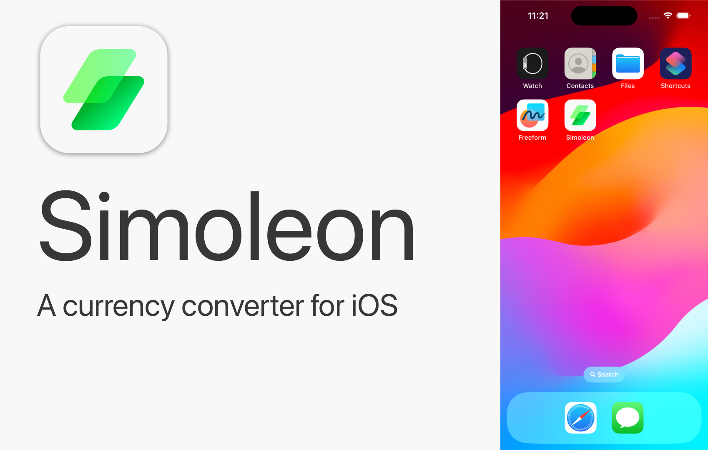
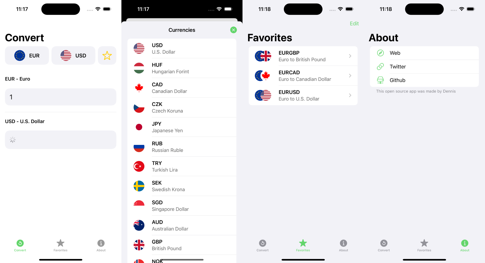

# simoleon

Simoleon is a currency converter app for iOS. The app itself is written in Swift and SwiftUI, and the backend is written in Python using Flask. I use [1Forge](https://1forge.com/) as my data provider.

